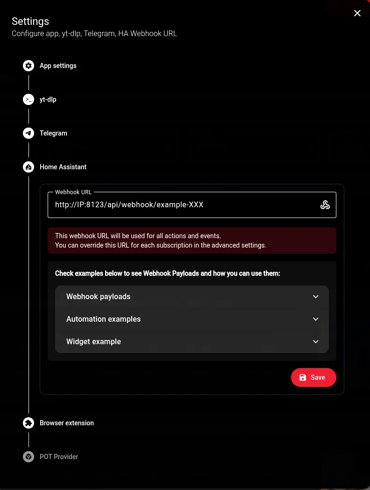
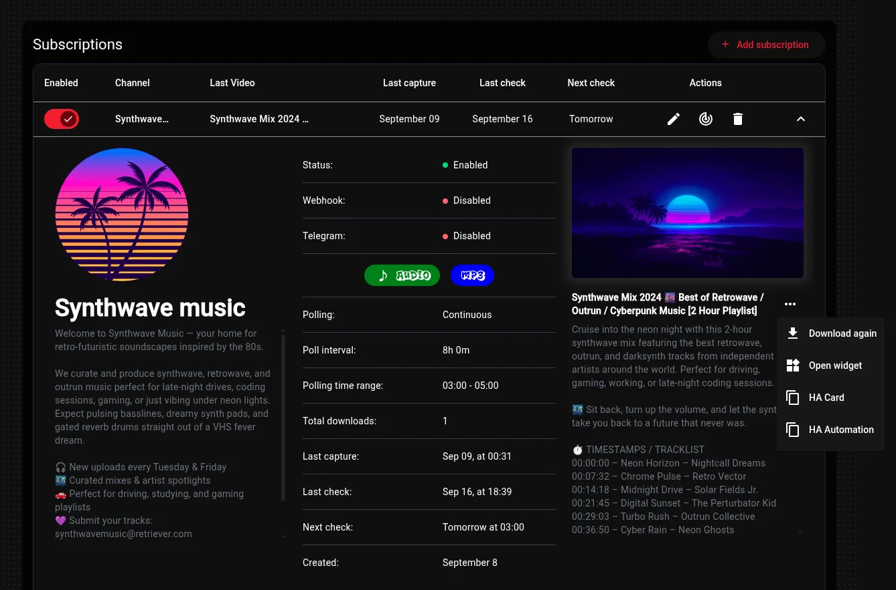

## 🏠 Home Assistant

**Webhooks.** Set a webhook URL in Settings (or override it per channel), you can press the webhook icon to send a test. The test posts the same shape a real notification does. Webhook payload examples you can check below.




The webhook is sent once the subscription's download has finished. `watcherId` is the watcher's own id — the same one the widget URL below takes — not the channel's YouTube id. `path` is the file's location inside the downloads folder, and `fileUrl` streams it from Retriever, the same URL the widget plays.

**Widget cards.** Each watcher has a compact page showing its latest video:

```
http://IP:31080/widget/<watcherId>
```


Drop that into an iframe card. The card plays the file in place — press the poster and the video (or audio) starts right there, no jump to another tab.

```yaml
type: iframe
url: http://localhost:31080/widget/1
aspect_ratio: 50%
```

**Don't type any of this.** Expand a subscription and open its **⋯** menu under poster:

- **Open widget** — the page on its own, to check it
- **HA Card** — Copy the YAML above, with this watcher's id filled in
- **HA Automation** — Copy the automation YAML, with the id and your webhook already in place

---

