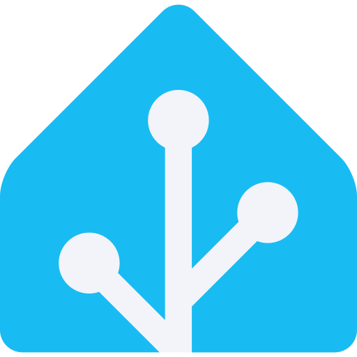

# 🐕 Retriever

**Your loyal friend for downloading and archiving video.**


---

## What is this?

Retriever is a self-hosted Web UI for `yt-dlp` 

Retriever also watches YouTube channels, fetches new uploads on its own and notifies your Smart Home.

Retriever does two jobs, and does them in one container:

**📥 Download anything, now.** Paste a video, playlist, or channel URL and it lands in your library — YouTube, TikTok, Instagram, or any of the thousand-odd sites `yt-dlp` supports. Pick the format, quality, and codec, trim a clip, split by chapters, cut sponsor segments.

**📡 Watch channels, forever.** Subscribe to a YouTube channel and Retriever polls its RSS feed on your schedule, downloading every new upload without you touching anything.

`yt-dlp` and `ffmpeg` ship **inside the image**, so downloads run in this container and land in the folder you mount at `/downloads`. Nothing else to install, no sidecar service to point at.

Perfect if you:

- Run a home server or NAS
- Archive channels before they disappear
- Want automation instead of a browser tab full of downloader sites

---

  🖥👩‍💻 [Installation](#docker)

   [Screenshots](SCREENSHOTS.md)

   [Browser extension](https://github.com/xinua/rt-ext)

   [Home Assistant](HA.md)

   [Telegram bot](TG.md)

## ✨ Features

### Download now

- 🌍 **YouTube, TikTok, Instagram**, and everything else `yt-dlp` handles
- ✂️ **Clip** a time range without fetching the whole video
- 📑 **Split by chapters** — one file per chapter
- 🚫 **SponsorBlock** — cut sponsor segments automatically
- 📂 **Destination folder** with autocomplete over folders you already use, plus filename prefixes
- ⚙️ **Extra** `yt-dlp` **arguments** per download, per channel, or globally

### Watch channels

- 📡 **RSS-based tracking** — no API key, no quota
- ⏱ **Flexible polling** — every N minutes within an optional active time range, or at one or more fixed times each day
- 1️⃣ **Intermittent polling** — stop polling for the day once a new video has been downloaded
- 🎯 **Per-channel settings** — type, format, codec, folder, prefix, extra args, webhook, SponsorBlock, split by chapters
- 🩳 **Shorts** included or skipped, your call

### The queue

- 📊 **Live progress** over WebSocket — percentage, real speed, honest ETA, size
- ⚡ **Parallel downloads**, configurable (default 2)
- 🔁 **Automatic retries** that know the difference between "try again" and "this video is gone"
- ⏹ **Retry, cancel, stop-all, delete, clear finished** — all one click
- 🔍 **Search and filter** by status and type (audio / video / thumbnail) across your whole history
- 🏷 **Real file info** — the actual size, quality, codec, format of every finished file, probed after download
- 🖼 **Posters everywhere** — when a download arrives with no artwork, a frame is pulled out of the file itself
- ▶️ **Play downloaded** — watch downloaded video by click on poster
- 🛡 **Atomic writes** — in-progress files live in a hidden temp folder and only move into place when complete, so your media scanner never sees a half-downloaded episode

### Integrations & interface

- 🔔 **Webhooks** — global or per-channel, with a test-send button that shows you the exact payload
- ✈️ **Telegram bot** — new-video and failed-download notifications, and a download bot: send it a link, get the video or MP3 back
- 🧩 **Browser extension** — Chrome/Firefox extension (*currently only manual installation*)
- 🖼️ **Widget page** — for Home Assistant iframe cards, with the latest video playable in place
- 📄 **Copy-ready Home Assistant YAML** — card and automation snippets, per subscription, one click each
- 🎨 **Seven theme colors** — ten section backgrounds, optional animations
- 📋 **Auto-paste** — the URL field grabs the link from your clipboard
- 🧲 **Drag to reorder** — the whole page layout
- 📱 **Responsive + PWA** — install like mobile app
- 🆙 **Update notification** — know when a new release is out and read its notes in the app

---

## 🚀 Quick start


### Docker

```bash
docker run -d \
  --name retriever \
  -p 31080:8000 \
  -v /your-directory/data:/data \
  -v /your-media/youtube:/downloads \
  ghcr.io/xinua/retriever:latest
```

Open **[http://localhost:31080](http://localhost:31080)** and paste a URL.

### Docker with POT

Two containers on a shared network, so Retriever can find the provider by name:

```bash
docker network create retriever-net

docker run -d \
  --name pot \
  --network retriever-net \
  --init \
  brainicism/bgutil-ytdlp-pot-provider:1.3.2

docker run -d \
  --name retriever \
  --network retriever-net \
  -p 31080:8000 \
  -e POT_BASE_URL=http://pot:4416 \
  -v /your-directory/data:/data \
  -v /your-media/youtube:/downloads \
  ghcr.io/xinua/retriever:latest
```

The network is the part people miss: containers only resolve each other by name
on a **user-defined** network, so without `docker network create` the
`http://pot:4416` above has nothing to point at. The provider needs no volumes
and no published port — only Retriever talks to it.

Open Settings (⚙️) after starting: a green **POT provider: connected** line
under the yt-dlp version means the two found each other.

### Docker Compose

Save as `docker-compose.yml` and run `docker compose up -d`:

```yaml
services:
  retriever:
    image: ghcr.io/xinua/retriever:latest
    container_name: retriever
    ports:
      - "31080:8000"
    volumes:
      - /mnt/tank/apps/retriever/data:/data
      - /mnt/tank/media/youtube:/downloads
    restart: unless-stopped
```


### Docker Compose with POT

```yaml
services:
  retriever:
    image: ghcr.io/xinua/retriever:latest
    container_name: retriever
    ports:
      - "31080:8000"
    volumes:
      - /mnt/tank/apps/retriever/data:/data
      - /mnt/tank/media/youtube:/downloads
    environment:
      POT_BASE_URL: http://pot:4416
    restart: unless-stopped

  pot:
    image: brainicism/bgutil-ytdlp-pot-provider:1.3.2
    container_name: retriever-pot
    init: true
    restart: unless-stopped
```

Already running a POT provider elsewhere on your network? Skip the second service and point at it directly — `POT_BASE_URL: http://192.168.1.50:4416`.

> **Versions.** The plugin ships inside the Retriever image and should match the provider server. If you pin the provider to a tag, pin it to the version this README documents (`1.3.2`); `latest` on both sides also stays in step. A mismatch logs a warning rather than breaking.

Two volumes matter:


| Mount        | What lives there                                                    |
| ------------ | ------------------------------------------------------------------- |
| `/data`      | Database, cached artwork, the download archive, the staged `yt-dlp` |
| `/downloads` | Your media                                                          |


---


## ⚙️ Configuration

Most settings live in the UI (⚙️ in the header). These environment variables are read at boot:


| Variable                | Default                    | What it does                                              |
| ----------------------- | -------------------------- | --------------------------------------------------------- |
| `PORT`                  | `8000`                     | Port inside the container                                 |
| `HOST`                  | `0.0.0.0`                  | Bind address                                              |
| `DATA_DIR`              | `/data`                    | Database, images, archive                                 |
| `DOWNLOADS_DIR`         | `/downloads`               | Default download root                                     |
| `YTDLP_BIN`             | `/usr/local/bin/yt-dlp`    | The bundled binary to stage from                          |
| `MAX_MANUAL_ITEMS`      | `500`                      | Cap on how many videos one pasted channel/playlist queues |
| `POT_BASE_URL`          | *(unset)*                  | POT provider server to use — see below. Unset = disabled  |
| `POT_PLUGIN_DIR`        | `/app/pot-plugin`          | Where the bundled POT plugin lives                        |
| `VERSION_CHECK_ENABLED` | `true`                     | Set to `false` to never look for a new release            |
| `VERSION_CHECK_WINDOW`  | `00:00-02:00`              | UTC window the daily check picks its random time from     |
| `VERSION_CHECK_URL`     | *(the manifest on GitHub)* | Where to read the published version from                  |


### Update check

Once a day Retriever reads its published `version.json` from GitHub to see whether a newer release exists, and serves the answer from `/api/version`. The check runs at a random moment inside `VERSION_CHECK_WINDOW` — a different one per install, so every Retriever in the world does not knock at the same second — and the result is cached in the database on your `/data` volume. Restarting the container replays that schedule rather than starting a new day, so restarts never cost a request; a failed check keeps yesterday's answer and retries in an hour. Nothing is sent: it is a plain GET of a public file. Set `VERSION_CHECK_ENABLED=false` to turn it off entirely.

In the **Settings** dialog you can set the downloads folder, a cookies file, global `yt-dlp` arguments, how many downloads run at once, your webhook URL and the Telegram bot — plus update `yt-dlp` itself with one click.

---


## 📁 How files are stored

Finished files are written to your `/downloads` mount, using the **Folder** and **Prefix** you chose:

```
/downloads/<folder>/<prefix><video title>.<ext>
```

Already-downloaded videos from watched channels are recorded in a per-subscription archive, `/data/archive/watcher-<id>.txt`, and are never fetched twice by that subscription. Deleting a subscription removes its archive too. (Manual downloads deliberately skip the archive — if you asked for a file explicitly, you get it.)

Download the same video into the same folder again and the new copy is numbered rather than overwriting the old one:

```
Never Gonna Give You Up.mp4
Never Gonna Give You Up (1).mp4
```

In-progress downloads live in `/downloads/.retriever-tmp/<id>/` and only move into place once complete. The directory is removed when the download settles, and abandoned ones are swept at boot.

Want the video id in the filename — useful when two videos in one folder share a title and would otherwise overwrite? Put your own template in **Extra yt-dlp arguments**; a later `-o` wins:

```
-o "%(title)s [%(id)s].%(ext)s"
```

---


## 🛠 Development

Angular 21 + Tailwind on the front, Fastify + SQLite (Drizzle) on the back.

```bash
pnpm setup    # install everything
pnpm dev      # frontend on :4200, backend on :8000
pnpm build    # production build of both
```

You'll want `yt-dlp` and `ffmpeg` on your `PATH` locally — the app falls back to them when the bundled binary isn't there.

---

**Looking for a feature or found a bug? [Open an issue or a PR!](https://github.com/xinua/retriever/issues)**

Licensed under the terms in [LICENSE.txt](LICENSE.txt).