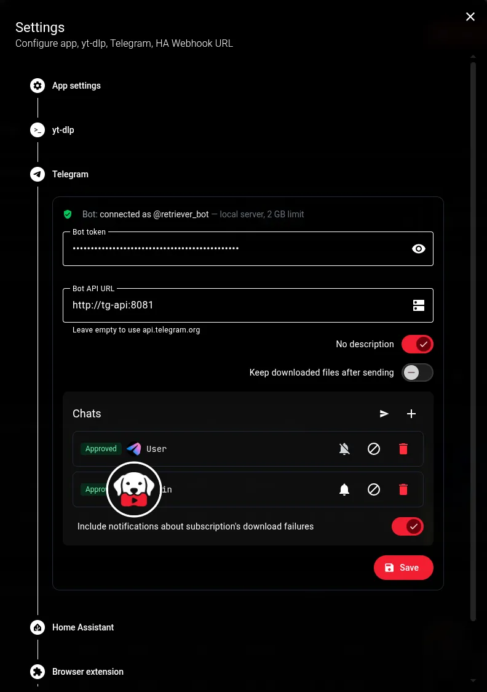

##  Telegram



### Setup

1. Create a bot with [@BotFather](https://t.me/BotFather) and copy its token
2. **Settings → Telegram bot**: switch it on, paste the token, **Save**. The status line should read *connected as @yourbot*
3. Send `/start` to the bot. The chat appears in Settings as **pending approval**. Until you approve it the bot ignores that chat completely, so a stranger who finds your bot gets no reply
4. Press ✓ to approve. The bot greets the chat, and it can now send links

Any number of chats can use the bot. You can rename each chat in the list, block it, or remove it.

### Notifications

Turn on **Notify** for every chat that should get them, then press **Test**. A chat doesn't have to be approved to receive notifications, because they only go out. To notify a group or channel where nobody can send `/start`, add the bot to it and use **Add chat** with its ID (for example `-1001234567890`).

- **New video**: sent for subscriptions with the **Telegram** flag turned on (under *Additional flags*). It's separate from the **Webhook** flag, so a subscription can notify Home Assistant, Telegram, both or neither.
- **Download failed**: a global toggle in Settings. Only downloads queued by subscriptions with the **Telegram** flag on are reported; manual and bot downloads never are.


### Downloading through the bot

Send a link to a single video (playlists and channels are refused). The bot replies with the title, the thumbnail, every resolution the video is actually available in with its estimated size, and an **MP3** button. Tap one, and the same message then shows the job's progress: *queued → downloading → uploading to Telegram*, or the error. When the file arrives, that message is removed.

- **Video** is always mp4 + H.264, sent as a playable video with its real size, duration and thumbnail. If a site has no H.264 stream at that size, the file is converted after the download (the reply marks those resolutions).
- **Audio** is always MP3.

Want other formats, codecs, clips or folders? Use the web UI. The bot is just another client of the same queue, so its jobs show up in **Downloads** like any other.

By default a file the bot downloaded is deleted once Telegram has it. Switch on **Keep downloaded files after sending** to leave it in `/downloads`, where Plex and similar apps will find it. A file is never deleted before it has been sent successfully.

### Size limit and the local Bot API server

`api.telegram.org` only accepts uploads of up to **50 MB**. The bot leaves out resolutions whose estimate is over the limit. If the finished file still turns out larger, the bot says so in the chat.

For files up to **2 GB**, run your own [telegram-bot-api](https://github.com/tdlib/telegram-bot-api) server next to Retriever. It is optional. It needs an `api_id` and `api_hash` from [my.telegram.org](https://my.telegram.org). You can use [this guide](https://my.telegram.org/apps). In local mode Retriever doesn't upload the file at all: it passes the server a path. So **the downloads folder must be mounted into both containers at the same path.**

```bash
docker network create retriever-net

docker run -d \
  --name tg-api \
  --network retriever-net \
  -e TELEGRAM_API_ID=123456 \
  -e TELEGRAM_API_HASH=0123456789abcdef0123456789abcdef \
  -v /your-directory/tg-api:/var/lib/telegram-bot-api \
  -v /your-media/youtube:/downloads:ro \
  --entrypoint telegram-bot-api \
  aiogram/telegram-bot-api:latest \
  --local --http-port=8081 \
  --dir=/var/lib/telegram-bot-api --temp-dir=/tmp/telegram-bot-api

docker run -d \
  --name retriever \
  --network retriever-net \
  -p 31080:8000 \
  -e POT_BASE_URL=http://pot:4416 \
  -v /your-directory/data:/data \
  -v /your-media/youtube:/downloads \
  ghcr.io/xinua/retriever:latest
```

The same with Compose:

```yaml
services:
  retriever:
    image: ghcr.io/xinua/retriever:latest
    container_name: retriever
    ports:
      - "31080:8000"
    volumes:
      - /mnt/tank/apps/retriever/data:/data
      - /mnt/tank/media/youtube:/downloads
    environment:
      POT_BASE_URL: http://pot:4416
    restart: unless-stopped

  tg-api:
    image: aiogram/telegram-bot-api:latest
    container_name: retriever-tg-api
    # Runs the server as root, so it can read the downloads whatever their
    # permissions. See the note below.
    entrypoint:
      - telegram-bot-api
      - --local
      - --http-port=8081
      - --dir=/var/lib/telegram-bot-api
      - --temp-dir=/tmp/telegram-bot-api
    environment:
      TELEGRAM_API_ID: "123456"
      TELEGRAM_API_HASH: 0123456789abcdef0123456789abcdef
    volumes:
      - /mnt/tank/apps/retriever/tg-api:/var/lib/telegram-bot-api
      # Same path as in the retriever service. Read-only is enough.
      - /mnt/tank/media/youtube:/downloads:ro
    restart: unless-stopped
```

> **File permissions.** The server has to be able to read every downloaded file. The image's default entrypoint drops to its own user, `telegram-bot-api` (uid 101). If your downloads folder isn't readable by that user, which is common on NAS datasets with `770` permissions or ACLs, every send fails with *can't get stat about the file*. The `entrypoint` above avoids that by running the server as root, and the `:ro` mount keeps it from changing anything. If you'd rather keep the default entrypoint, give uid 101 read and traverse access to the downloads folder and the files created in it.

The `pot` service is optional here too. Then, in **Settings → Telegram bot**, set **Bot API URL** to `http://tg-api:8081` and save. The status line should switch to *local server, 2000 MB limit*.

> **Already used the bot with api.telegram.org?** Before the same token works with a local server, the bot has to be logged out of the cloud API once. Use **Log out from cloud API** in Settings, then save the local URL. After a log-out, Telegram doesn't let the bot back onto the cloud API for about 10 minutes.

A few more things to know:

- The server's user has to be able to read your media files.
- Only one Retriever may poll a given bot token at a time. A second instance makes Telegram answer `409 Conflict`, which shows up in the status line.

---